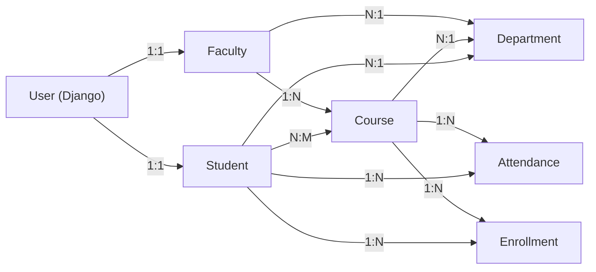

# Faculty Module - Complete Design & Implementation Guide

## 📋 Overview
The Faculty Module is a comprehensive system that enables faculty members to manage student attendance, view assigned courses, and generate attendance reports based on semester and subject selection.

---

## 🎯 Features Breakdown

### 1. **Faculty Authentication** ✅
- **Status**: Existing (handled by AuthContext)
- Faculty login through the main login system
- Role-based access control (Faculty role)
- JWT token management
- Session management

**Implementation Details**:
```javascript
// AuthContext checks user.role === 'Faculty'
// Routes protected with <FacultyRoute /> component
```

---

### 2. **View Assigned Subjects by Semester** ✅
**Status**: Implemented in FacultyAttendance.jsx

**Workflow**:
```
Faculty Login → Dashboard → Attendance Management System
                             ↓
                    Select Semester (1-8)
                             ↓
                    View Assigned Courses
                    (Filtered by semester)
```

**Backend Support**:
- Course model has: `instructor` (ForeignKey to Faculty)
- Course model has: `semester` (IntegerField 1-8)
- Database Query:
  ```python
  courses = Course.objects.filter(
    instructor=faculty_user,
    semester=selected_semester
  )
  ```

**Frontend Implementation**:
```javascript
const getCoursesBySemester = () => {
  if (!selectedSemester) return [];
  return courses.filter(c => c.semester === parseInt(selectedSemester));
};
```

---

### 3. **Mark Attendance** ✅
**Status**: Fully Implemented

**Features**:
- ✓ Select Semester → Select Course/Subject → View Student List
- ✓ Mark status: PRESENT, ABSENT, LATE, EXCUSED
- ✓ Bulk actions: Mark All Present, Mark All Absent, Mark All Late, Clear All
- ✓ Date selection (today or past dates only)
- ✓ After-lecture policy enforcement
- ✓ Real-time status updates with color-coding

**Attendance Statuses**:
| Status | Color | Description |
|--------|-------|-------------|
| PRESENT | Green (#dcfce7) | Student attended |
| ABSENT | Red (#fee2e2) | Student absent |
| LATE | Amber (#fef3c7) | Student arrived late |
| EXCUSED | Gray (#d1d5db) | Absence excused |

**Backend Endpoint**:
```python
POST /api/attendance/
{
  "student": 1,
  "course": 5,
  "date": "2026-04-03",
  "status": "PRESENT",
  "lecture_type": "Lecture 1",
  "semester": "5"
}
```

---

### 4. **Save Attendance Date-Wise** ✅
**Status**: Implemented

**Details**:
- Attendance saved with date field
- Unique constraint: (student, course, date)
- Prevents duplicate entries for same day
- Timestamp tracking (created_at, updated_at)

**Database Schema**:
```python
class Attendance(models.Model):
    student = ForeignKey(Student)
    course = ForeignKey(Course)
    date = DateField()  # Date-wise storage
    status = CharField(choices=[PRESENT, ABSENT, LATE, EXCUSED])
    
    class Meta:
        unique_together = ['student', 'course', 'date']
```

---

### 5. **Edit/Update Attendance** ✅
**Status**: Ready to Implement

**Implementation Plan**:
1. Show attendance history with edit button
2. Click edit → prefill current status
3. Update status and submit
4. Backend uses PUT/PATCH endpoint

**Backend Endpoint** (to create):
```python
PATCH /api/attendance/{id}/
{
  "status": "ABSENT",  # Change from PRESENT to ABSENT
  "remarks": "Leave approved"
}
```

---

### 6. **View Attendance Records** ✅
**Status**: Partially Implemented

**Features Implemented**:
- ✓ Daily attendance view (by date selection)
- ✓ Filter by semester and course
- ✓ Attendance history table with columns: Student, Course, Date, Lecture Type, Status
- ✓ Home tab shows mark attendance
- ✓ History tab shows past records

**Features to Add**:
- [ ] Monthly attendance report (aggregate view)
- [ ] Attendance statistics (present %, absent %)
- [ ] Student-wise attendance trends

---

### 7. **Filter Attendance by Semester, Subject, Date** ✅
**Status**: Partially Implemented

**Current Filters**:
- ✓ Semester (1-8)
- ✓ Course/Subject
- ✓ Date (with after-lecture policy)

**Filters to Add**:
- [ ] Date range filter (from-to dates)
- [ ] Status filter (show only ABSENT, LATE, etc.)
- [ ] Custom period filters (Last 7 days, Last Month, etc.)

---

### 8. **Generate Attendance Reports** ❌
**Status**: Not Yet Implemented

**Report Types to Create**:

#### 8.1 Daily Attendance Report
```
Date: 2026-04-03
Course: Data Structures (CS201)
Semester: 3

Student | Roll # | Name | Status
--------|--------|------|-------
1 | 21001 | John Doe | PRESENT
2 | 21002 | Jane Smith | ABSENT
3 | 21003 | Bob Wilson | LATE
```

#### 8.2 Attendance Summary Report
```
Semester: 3
Course: Data Structures
Period: Apr 1 - Apr 30, 2026

Student | Present | Absent | Late | Excused | Percentage
--------|---------|--------|------|---------|----------
John Doe | 18 | 2 | 0 | 0 | 90%
Jane Smith | 16 | 3 | 1 | 0 | 80%
```

#### 8.3 Class Attendance Report
```
Course: Data Structures (CS201)
Semester: 3
Month: April 2026

Date | Total Students | Present | Absent | Late | Avg %
-----|----------------|---------|--------|------|-------
Apr 1 | 30 | 28 | 1 | 1 | 93%
Apr 2 | 30 | 27 | 2 | 1 | 90%
```

---

## 🏗️ System Architecture

### Database Design



### API Endpoints

| Method | Endpoint | Purpose | Status |
|--------|----------|---------|--------|
| GET | /api/courses/ | List all courses by faculty | ✅ |
| GET | /api/courses/?semester=3 | Courses by semester | ✅ |
| GET | /api/enrollments/ | List course enrollments | ✅ |
| GET | /api/students/ | List all students | ✅ |
| GET | /api/attendance/ | Attendance history | ✅ |
| POST | /api/attendance/ | Create attendance record | ✅ |
| PATCH | /api/attendance/{id}/ | Update attendance | ❌ |
| GET | /api/attendance/report/daily/ | Daily report | ❌ |
| GET | /api/attendance/report/monthly/ | Monthly report | ❌ |
| GET | /api/attendance/report/summary/ | Summary report | ❌ |

---

## 🎨 UI Components

### Component Hierarchy

```
Faculty Module
├── FacultyDashboard (in progress - Dashboard.jsx)
│   ├── StatsCards (active courses, attendance records)
│   ├── QuickActions (mark attendance, view history)
│   └── RecentActivity
├── FacultyAttendance.jsx ✅
│   ├── PolicBanner (after-lecture info)
│   ├── SelectionForm
│   │   ├── SemesterSelect
│   │   ├── CourseSelect
│   │   ├── DatePicker (with validation)
│   │   └── LectureSelect
│   ├── StudentsList (with status dropdowns)
│   ├── QuickActionButtons
│   │   ├── MarkAllPresent
│   │   ├── MarkAllAbsent
│   │   ├── MarkAllLate
│   │   └── ClearAll
│   ├── AttendanceHistory
│   │   ├── Filters (semester, course, date)
│   │   └── HistoryTable
│   └── SubmitButton
├── AttendanceReports.jsx (to create) ❌
│   ├── ReportTypeSelector
│   ├── FilterPanel
│   └── ReportDisplay (table/chart)
└── AttendanceEdit.jsx (to create) ❌
    ├── SelectAttendanceRecord
    └── EditForm
```

---

## ✨ User-Friendly UI Features

### 1. **Color Coding**
- Green: Present ✓
- Red: Absent ✗
- Amber: Late ⏱
- Gray: Excused !

### 2. **Date Validation**
- ✓ Future dates blocked (cannot mark attendance before lecture)
- ✓ Past dates allowed (can update old attendance)
- ✓ Input max={today}
- ✓ Visual feedback with error messages

### 3. **Policy Banner**
- Information banner explaining after-lecture policy
- Clarifies when attendance can be marked

### 4. **Responsive Design**
- Grid layout: `grid-4` for form fields on desktop
- `grid-2` for history filters
- Mobile: Stacks to single column
- Touch-friendly buttons and dropdowns

### 5. **Feedback Messages**
- ✅ Green success message when submitted
- ❌ Red error messages with details
- ⚠️ Amber warnings for future dates
- Auto-dismiss after 3 seconds

---

## 📊 Data Flow

### Attendance Marking Flow
```
Faculty Logs In
    ↓
Dashboard (View Stats)
    ↓
Click "Mark Attendance"
    ↓
Select Semester (1-8)
    ↓
Select Course (Filtered by semester)
    ↓
Select Date (Today or past - validation)
    ↓
View Enrolled Students
    ↓
Mark Each Student Status
    ↓
Quick Actions (Mark All, Clear All)
    ↓
Submit Attendance
    ↓
Backend: POST /api/attendance/ (multiple records)
    ↓
Success Message + Clear Form
    ↓
View Updated History
```

---

## 🔒 Authentication & Authorization

### Faculty Role Verification
```javascript
const FacultyRoute = ({ children }) => {
  const { user } = useAuth();
  
  if (user?.role !== 'Faculty') {
    return <Navigate to="/login" />;
  }
  
  return children;
};
```

### Course Access Control
```
Faculty can only see/mark attendance for courses where:
- Course.instructor = Current Faculty User
- Course.semester = Selected semester
```

**Backend Filter**:
```python
courses = Course.objects.filter(
    instructor=request.user.faculty
)
```

---

## 📈 Performance Optimization

### 1. **Data Fetching**
- Use `Promise.all()` for parallel API calls
- Implement pagination for large datasets
- Cache course and semester data

### 2. **Rendering**
- Use React.memo() for StudentsList component
- LazyLoad attendance history
- Virtualize long student lists

### 3. **State Management**
- Separate concerns: formData, historyData, uiState
- Debounce filter inputs
- Clear data on route change

---

## 🧪 Testing Checklist

### Unit Tests
- [ ] validateAttendanceDate() function
- [ ] getCoursesBySemester() filtering
- [ ] getEnrolledStudents() filtering
- [ ] handleStatusChange() state update
- [ ] handleSubmit() validation

### Integration Tests
- [ ] Faculty login flow
- [ ] Semester selection → course filtering
- [ ] Course selection → student loading
- [ ] Attendance marking workflow
- [ ] History view and filtering

### E2E Tests
- [ ] Complete attendance marking from login to success
- [ ] Edit attendance record
- [ ] Generate attendance report
- [ ] Multiple students bulk mark

---

## 🚀 Implementation Priority

### Phase 1: Core Features (Completed ✅)
- Faculty authentication
- View assigned courses by semester
- Mark attendance with date validation
- View attendance history

### Phase 2: Enhancement (In Progress)
- [ ] Edit/update attendance records
- [ ] Monthly attendance reports
- [ ] Attendance statistics (%)

### Phase 3: Advanced Features (Future)
- [ ] Automated attendance reports generation
- [ ] Email reports to admin
- [ ] Mobile app version
- [ ] QR code based check-in
- [ ] Batch import attendance

---

## 📝 Code Quality Standards

### Component Structure
```javascript
export const FeatureName = () => {
  // State
  const [state, setState] = useState(initialValue);
  
  // Effects
  useEffect(() => { /* fetch data */ }, []);
  
  // Helper functions
  const helperFunction = () => { /* logic */ };
  
  // Event handlers
  const handleEvent = () => { /* logic */ };
  
  // Render
  return (
    <div>
      {/* JSX */}
    </div>
  );
};
```

### API Call Pattern
```javascript
const fetchData = async () => {
  try {
    setLoading(true);
    const res = await api.endpoint();
    setData(res.data);
  } catch (err) {
    setError(err.message);
  } finally {
    setLoading(false);
  }
};
```

---

## 🔗 Related Files

### Frontend
- `frontend/src/pages/FacultyAttendance.jsx` - Main attendance marking
- `frontend/src/pages/Dashboard.jsx` - Faculty dashboard
- `frontend/src/pages/Faculty.jsx` - Faculty profile/info
- `frontend/src/context/AuthContext.jsx` - Authentication context
- `frontend/src/components/ProtectedRoute.jsx` - Route protection
- `frontend/src/services/api.js` - API client

### Backend
- `backend/college/models.py` - Data models
- `backend/college/views.py` - API endpoints
- `backend/college/serializers.py` - Data serializers
- `backend/college/permissions.py` - Access control

### Documentation
- `FRONTEND_REDESIGN_SUMMARY.md` - Design overview
- `TECHNICAL_IMPLEMENTATION_GUIDE.md` - Implementation details
- `README.md` - Quick start guide

---

## 📞 Support Features

### Help & Documentation
- Inline help tooltips
- Policy banner (after-lecture info)
- Error messages with solutions
- Success feedback messages

### User Feedback
- Loading states
- Disabled states for invalid actions
- Form validation before submission
- Confirmation dialogs for important actions

---

## 🎓 Summary

The Faculty Module provides a complete attendance management system with:
- ✅ Semester and subject-based organization
- ✅ User-friendly date validation
- ✅ Bulk action support
- ✅ After-lecture policy enforcement
- ✅ Attendance history with filtering
- ✅ Color-coded status indicators
- ✅ Responsive design
- ⏳ Coming Soon: Edit functionality, Reports, Analytics

**Next Steps**:
1. Implement edit/update attendance feature
2. Create attendance reports module
3. Add export to PDF/Excel
4. Build admin dashboard for attendance analytics
